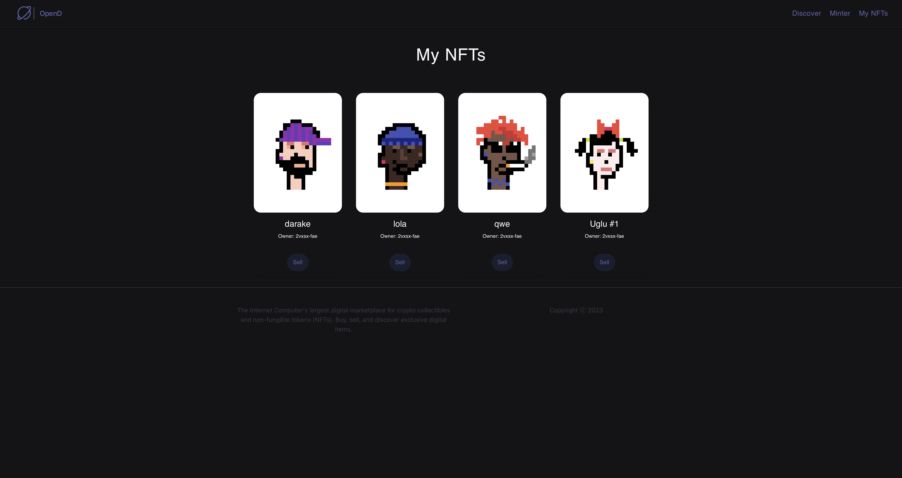
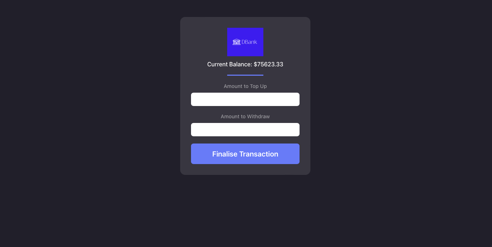
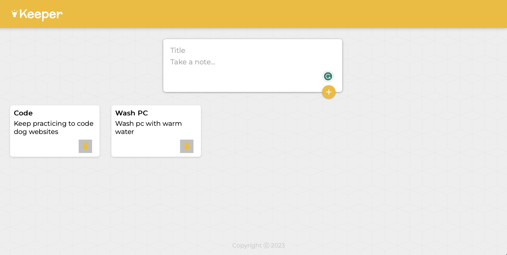
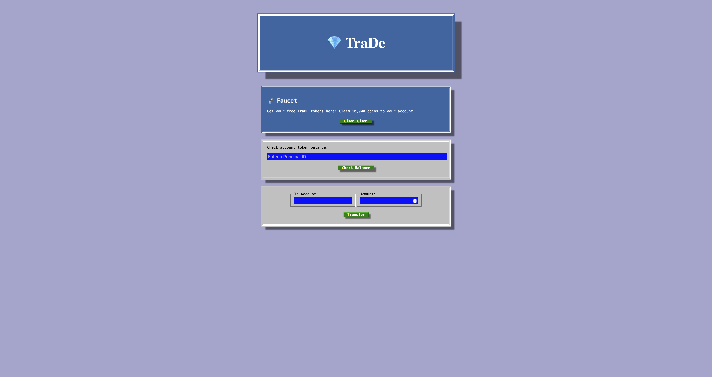
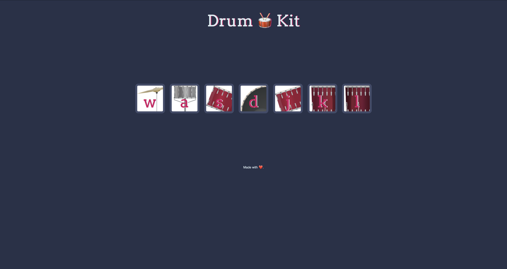
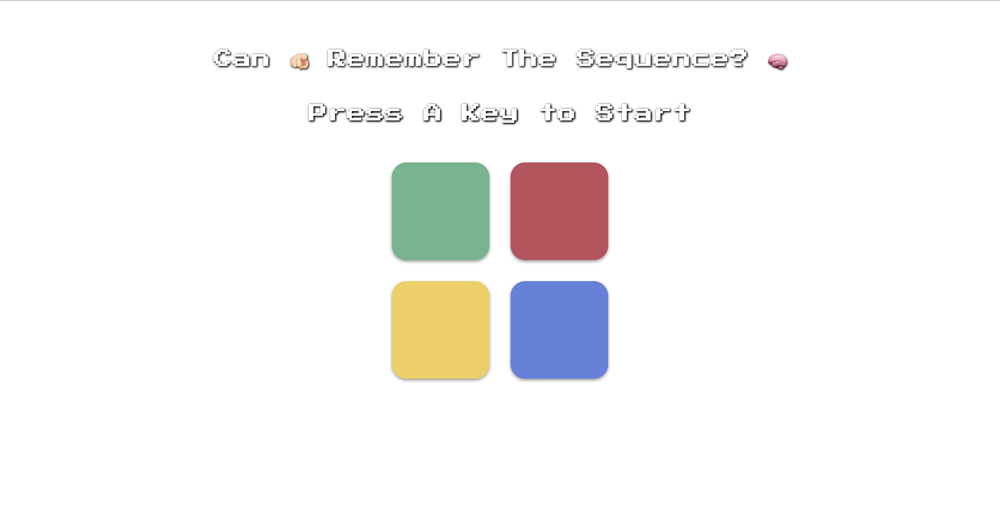

<h1> Hi! I'm Diwash.</h1>


<p> A fullstack developer from  <b>Kathmandu, Nepal</b>. </p>

### 👨🏻‍💻 Languages


<br />
  


###  A little more about me...  

```javascript
const Nepali = {
  pronouns: "he" | "him",
  code: [Javascript, Typescript, HTML, CSS, Python, C],
  tools: [React, Node, Styled-Components],
  details: {
                        experience: "2yrs",
                        languages: "Nepali, English, Hindi" 
                      },
 current_work: "Working on a portfolio site for myself."

}
```

#

### 📺 Projects

<!-- BEGIN CARDS -->
### Decentralized NFT Marketplace


****

### Decentralized bank


****

### Decentralized Notes / Keeper 



### Decentralized Token / Coin


****

### Tinder for dogs ( TinDog )


****

### Drumkit


****

### Simon Game


<!-- END CARDS -->
